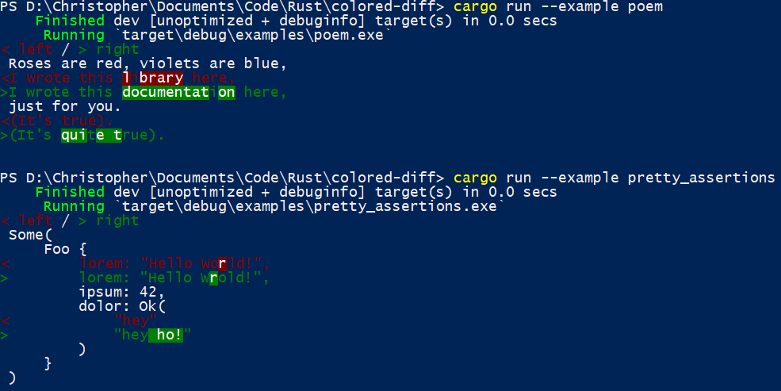
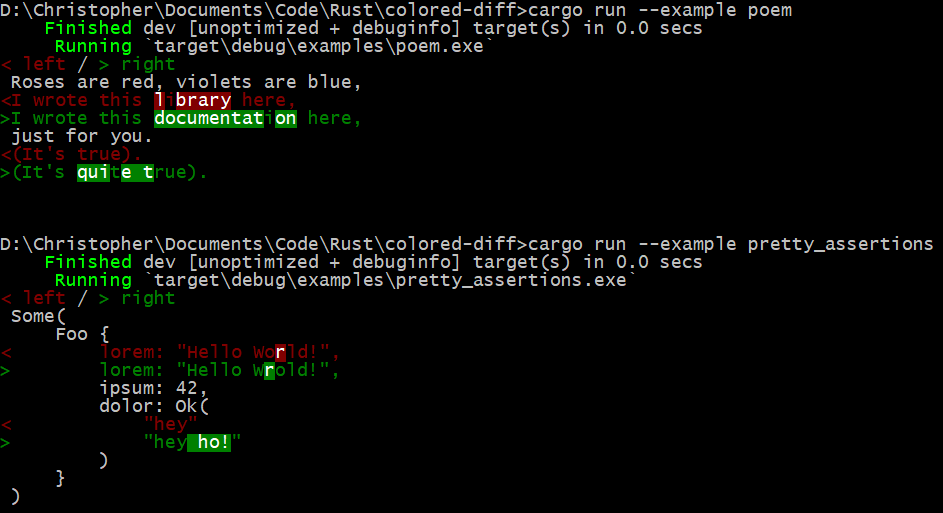

# colored-diff

Show colored differences between source strings!

Inspired by / extracted from [pretty-assertions](https://github.com/colin-kiegel/rust-pretty-assertions)
and [difference's github-style example](https://github.com/johannhof/difference.rs/blob/master/examples/github-style.rs)

Powershell:  


Command Prompt:  


(Now accepting PRs for a macOS Terminal and/or Ubuntu (whatever console window) examples!)

[Poem Example](examples/poem.rs):

```rust
let expected = "\
    Roses are red, violets are blue,\n\
    I wrote this library here,\n\
    just for you.\n\
    (It's true).\n\
";
let actual = "\
    Roses are red, violets are blue,\n\
    I wrote this documentation here,\n\
    just for you.\n\
    (It's quite true).\n\
";

println!("{}", colored_diff::PrettyDifference { expected, actual })
```

[Pretty-Assertions Example](examples/pretty_assertions.rs):

```rust
#[derive(Debug, PartialEq)]
struct Foo {
    lorem: &'static str,
    ipsum: u32,
    dolor: Result<String, String>,
}

let x = Some(Foo { lorem: "Hello World!", ipsum: 42, dolor: Ok("hey".to_string())});
let y = Some(Foo { lorem: "Hello Wrold!", ipsum: 42, dolor: Ok("hey ho!".to_string())});

let x = format!("{:#?}", x);
let y = format!("{:#?}", y);

println!("{}", colored_diff::PrettyDifference { expected: &x, actual: &y })
```
